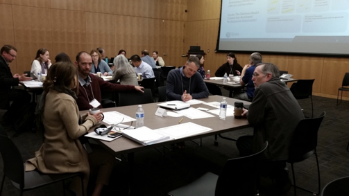

# Alaska State Library, Juneau, AK

**Partner organizations:** Alaska Office of Management and Budget \(OMB\) and Office of Information Technology \(OIT\)

**Library roles played:** [Connecting data producers](../library-roles/connecting-data-producers.md), [Connecting data users](../library-roles/connecting-data-users.md)


**This project shows the important role that state libraries can take in coordinating civic data at the state level. State libraries, as with Alaska, sometimes have a mandate to provide access to state information; this mandate can provide stimulus for initiatives that specifically address open data. While this project has a large scale goal in mind, the eventual creation of a statewide data hub, a lot of groundwork was necessary to begin the process. The Alaska State Library played the role of convener by hosting a  two-day Alaska Community Innovation Summit that included an ecosystem mapping exercise. As they observe in their case study, building and strengthening relationships was a significant outcome of the Summit, and put the state in a better position towards its goal of a statewide data hub.**


Alaska is geographically large, but fewer than 800,000 people live here. There is little capacity within many of our communities for robust data collection, dissemination and transformation.  Much of this work is carried out in silos at the state level by Alaska state agencies and the University of Alaska system, rather than at the local government level. At the same time, [The Alaska State Library](https://library.alaska.gov/) has a statutory mandate to promote a system for centralized access to data produced at both the state and local government levels, and the State of Alaska is engaged in an effort to build a robust data and digital asset management program.

To mitigate data siloing and fulfill the library's mandate, the Alaska State Library \(Library\), Alaska Office of Management and Budget \(OMB\), and Office of Information Technology \(OIT\)\) are planning a Statewide Data Hub \(Data Hub\). The Data Hub will incorporate data catalog services and tools enabling data users, producers, and intermediaries to share, use, and transform State of Alaska data.  

To aid in the development of a project plan and requirements we worked on mapping and analysis of the State data ecosystem. This work was driven by a focus on three overall aspects of the ecosystem that would most help in the development of a Data Hub project plan and proposal: 1\) identifying State data that is most frequently shared and used; 2\) the benefits generated by sharing and use of State data; and 3\) the relationships and trust among data producers, intermediaries, and users. 

This project had a few different components, including the creation and dissemination survey to people and organizations that use State data and the convening of  a two-day Alaska Community Innovation Summit meeting with stakeholders, including data intermediaries, community organizations, businesses, and State agencies. The Summit included presentations, small group discussion, and business modeling sessions designed to identify how data users and intermediaries access and transform State data. The Library helped to develop and publicize the survey and compile survey results, identify data ecosystem members who would present diverse perspectives at the Summit, and organize the logistical details of the Summit.

Through the Summit, we learned that there are some gaps in the State’s data ecosystem.  There are few data intermediaries which transform or support transformation of State data.  In addition, agencies themselves often lack the capacity to publish their data and users sometimes don’t know that the data exists or who to contact to obtain it.  And we identified a need for data literacy training among both the public and State personnel. 

There is a fear among some data producers that they will lose control over their data.  In order to foster the change in culture necessary for a successful Data Hub, we used the Summit to build trust among  stakeholders. Stakeholders valued the opportunity to gather together at the Summit, make connections, learn from each other, and become familiar with the State data ecosystem as well as the general concept of a Data Hub and the benefits that it might yield.

> ## One of the greatest successes of this project was simply building relationships between members of the ecosystem.  This would not have been possible without a forum for open and honest discussion.

This work helped us to develop relationships, understanding of our State’s data ecosystem, and use cases necessary to bolster support for the Data Hub.  But also, we’ve been developing workgroups with representatives from various State agencies. Having agencies involved in the planning process gives them some ownership of the process. One of the greatest successes of this project was simply building relationships between members of the ecosystem.  This would not have been possible without a forum for open and honest discussion. The Library’s role as a trusted and unbiased community center can’t be underestimated.  As the State develops the Data Hub, the Alaska State Library can and should continue to provide a place for citizens and government to learn from each other.  

### **Learn More:**

* [Summary Survey Results](https://data.alaska.gov/rdf/data/sacis-survey-2019/2019-Alaska-Community-Innovation-Summit-State-Data-Use-Survey.xlsx.)

