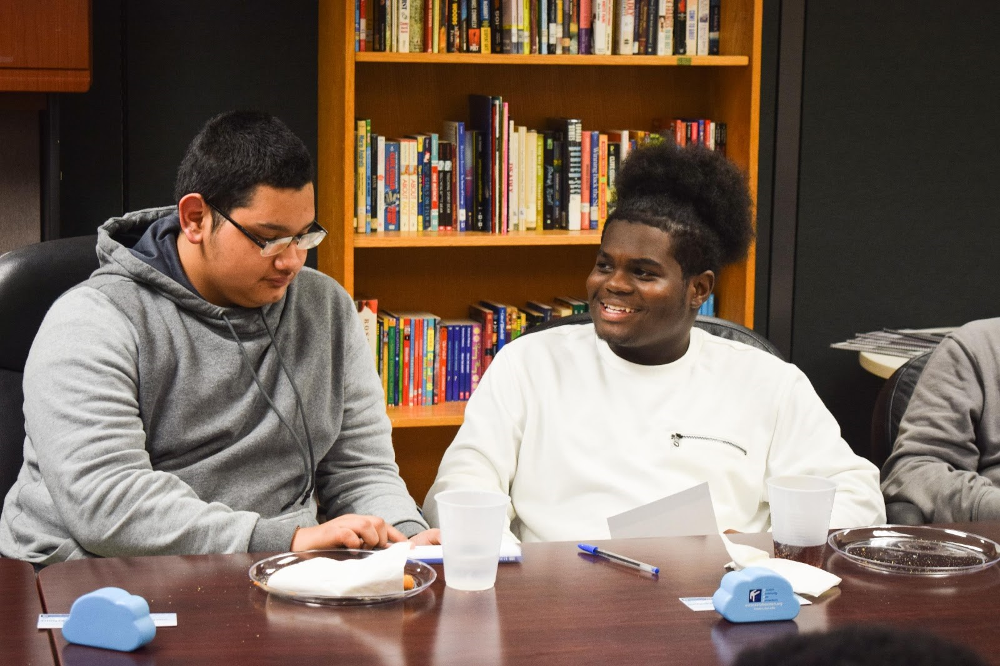

# Fondren Library,  Rice University, Houston, TX

**Partner organization:** Kinder Institute for Urban Research, Rice University

**Library roles played:** [Developing Civic Data Literacy](../library-roles/developing-civic-data-literacy.md), [Showing the Importance of Civic Data](../library-roles/showing-importance-civic-data.md), [Connecting Data Users](../library-roles/connecting-data-users.md)


The Fondren and Kinder team piloted data literacy workshops with community members and then incorporated what they learned into a 'train the trainers' workshop for the United Way of Greater Houston. Rather than designing the workshops around a particular technical skill or tool, their workshop design deliberately emphasized general principles of data, and ways data might support participants' decision-making.


Through our project, we attempted to break down barriers to data access and engagement by introducing young community members in two under-resourced and underserved communities to the fundamentals of data and its applications.  

In the original proposal, we planned to host three workshops with nonprofits that are interested in engaging clients with data training. We decided to change the format and instead offer the first two data literacy workshops directly to underserved communities. We used those workshops as case studies and opportunities to create curricula that are appropriate for an audience with varying levels of data literacy and exposure to data concepts. By sharing the first-hand experiences and our lessons-learned with nonprofits \(along with the training materials\), we could help nonprofit staff members gain a better understanding of how to deliver an effective data literacy training.

After our pilot data literacy trainings, we reflected on and organized our learnings to create a “train the trainers” workshop that was conducted in collaboration with the United Way of Greater Houston. With this final training in our three-part series, we wanted to expand our reach and impact by equipping nonprofit professionals \(who work in direct service roles in the fields of workforce development and financial coaching\) to guide their diverse clients through the data literacy frameworks we generated for the first two trainings. 

Throughout the creation and facilitation of our trainings, we were careful not to conceptualize data literacy as the mastery of a particular skill or proficiency in certain technologies, etc. Rather, we strived to create curricula that enhance participants’ understanding of the underlying principles of data and facilitate the use of data in a way that supports participants’ arguments or decision-making processes. We wanted to empower participants to comprehend, interpret and use the data they encounter—and even to produce and analyze their own data.

One of our challenges was understanding how to target our training efforts, since it wasn’t clear what prior knowledge or learning goals participants would bring to the workshops. With our first workshop, we were able to conduct a pre-assessment, which helped us to understand how much our group of high school students already knew about data literacy. We also consulted with our workshop hosts to learn more about our participants and their interests and needs. We learned about the value of connecting our training with programs that have set clear expectations for participants


In the next section, Fondren and Kinder team members reflect on how their civic data work ties into their institutional missions and how each benefitted from the partnership. In this case the partnership also helped the project reach new audiences for the library and deepen existing relationships through the project activities.


The Kinder Institute for Urban Research seeks to facilitate the practical use of data by city and community leaders for decision-making and capacity building in Houston’s disadvantaged communities. The Kinder Institute team members on this project were able to leverage their community connections and training-related learnings during the planning and execution of this project.

In the Library’s recent strategic plan, there is an aim to enhance training in, managing, analyzing, and visualizing data and to engage with Houston and the world. Fondren currently offers workshops and consulting on topics such as data management and software skills; we also work with the local community by developing archival collections and by hosting tours and events. 

Through our partnership with the Kinder Institute, the Fondren team was  able to develop a more nuanced understanding of data literacy and to work more closely with local organizations, especially those focused on underserved communities. The Kinder Institute team members on this project were able to leverage their community connections and training-related learnings during the planning and execution of this project**.**

> ## **This project demonstrated the value of partnering with a leading civic research organization in order to deepen the library’s impact on the community.**

This project demonstrated the value of partnering with a leading civic research organization in order to deepen the library’s impact on the community. Through Kinder’s relationships with the Urban Enrichment Institute and the United Way, we were able to shape a curriculum that met the needs of participants and draw an engaged audience. It also showed the effectiveness of a playful, hands-on data literacy curriculum, particularly with younger audiences. In our discussion with the public library, we also learned that adult library patrons are another potential audience, as several of their patrons expressed interest in data training. The librarians were very receptive to and supportive of our work and seem open to future collaborations. We  are exploring the possibility of partnering to develop and deliver data literacy training for area nonprofits.

### **Learn more:** 

* [Data Literacy Trainings Toolkit](https://tinyurl.com/y6y43rws)
* Daniel Koh and Katie Wang, “[Rice collaboration uses data to engage and empower local communities,](https://kinder.rice.edu/urbanedge/2019/09/04/rice-collaboration-uses-data-engage-and-empOwer-local-communities)” Urban Edge blog, Sep 4, 2019, 
* Julia Kress, “[Grant-Funded Data Literacy Workshops Pair Fondren and Kinder Institute](https://scholarship.rice.edu/handle/1911/106116),” News from Fondren, Spring 2019, 

\_\_

