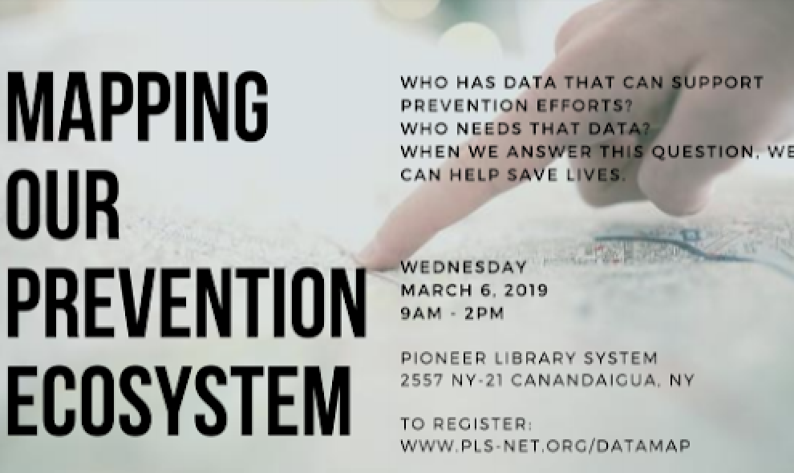

# Pioneer Library System, Ontario County, NY

**Partner organizations:** [Substance Abuse Prevention Coalition of Ontario County](https://partnershipforontariocounty.org/community-programs/prevention-coalition/)

**Library roles played:**  [Connecting data producers](../library-roles/connecting-data-producers.md), [Connecting data users](../library-roles/connecting-data-users.md), [Showing the importance of Civic Data](../library-roles/showing-importance-civic-data.md)


**Substance abuse prevention is an issue of concern for Ontario County, NY. The county already had a cross-sector group, the Substance Abuse Prevention Coalition \(SAPC\) of Ontario County, with an interest in the availability and sharing of data.** [**The Pioneer Library System**](https://pioneerlibrarysystem.org/)**, a multi-county cooperative system serving 42 public libraries, collaborated with SAPC to hold an ecosystem mapping event to better understand how local organizations obtain, use, and share data. Going forward, SAPC is working to find a permanent home for the ecosystem map while the library considers if it has the capacity to prioritize civic data work.**


Having a data conversation for the Substance Abuse Prevention Coalition \(SAPC\) has been a long time coming. Everyone there collects data to some degree but don't think of themselves with that hat \[i.e, coordinating data sharing\].

The project kicked off with a half-day session hosted by the Pioneer Library System. The event was open to all community members and included a presentation, time for relationship building, ecosystem mapping activity and lunch. Attendees included people affiliated with the Substance Abuse Prevention Coalition, mental health, education, and other players in the prevention or harm reduction arena. The conversation was scaffolded, beginning by unpacking "what is data?, continued through the SAPC data collection/sharing journey, description of data roles, then moved through an introduction to ecosystem mapping, leading to the development of the map. 

> ## The discussion was lively as the groups sorted out their approach to realizing the ecosystem.

Community members in attendance split into two -- it was easier for people to participate in smaller groups -- and began to work though mapping the prevention ecosystem. The discussion was lively as the groups sorted out their approach to realizing the ecosystem. The conclusion of the event brought everyone together which allowed for a deeper discussion on the map visualization. 

After the initial kickoff event, subsequent conversations and collaborative activities were held as part of an Ontario County Substance Abuse Prevention Coalition meeting, which provided additional opportunities to share the map from the workshop with law enforcement, local government and community members. This exercise exposed the amazing potential this map could provide to stimulate discussion about data sharing, as well as important relationship building, within the Ontario County prevention ecosystem. As an example, at the coalition meeting the police chief and mayor were interested in tobacco data and someone there was representing a tobacco action group. They began talking and are now data sharing.

While we gained some real traction, it is unclear how high of a priority that data in general has and the importance of the transparency of our data collecting, sharing, reporting capabilities have in the prevention ecosystem. In the prevention world, people ask for the same data all the time, but the term “data” as it is, often causes a loss of interest. Its necessity seems to score a low priority with many, which continues to be a challenge. 

We completed the first phase a semi live map, the implications are endless but there is so much left to be done. Once completed it will need to be updated at least once a year to remain current. There may be some interest in the United Way taking over this project, but it is uncertain if the focus of the map would remain on understanding the data relationships or would pivot to primary functions/activities/programs that each of their programs are running. 

While the library system doesn't do anything directly with substance abuse data itself, the ecosystem mapping activity showed how we could do this kind of work with any kind of information, in any area that we could be a key player in. As a library system, we are interested in data for knowing what's making the largest impact in communities so that the local libraries can partner with community groups, and community development in general. We are interested in increase or decline in funding sources, and helping libraries make decisions about funding models.  
  

