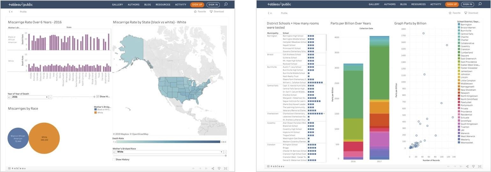
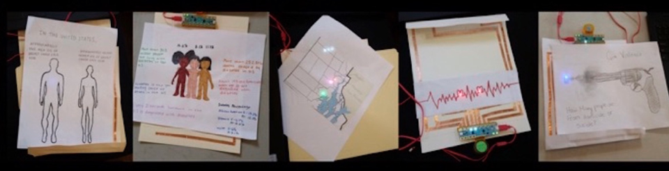
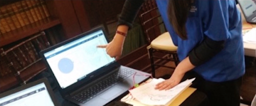

# Providence Public Library, Providence, RI

**Partner organizations:** [NEXMAP ****](http://www.nexmap.org/)\(non-profit civic tech organization\) , [Chibitronics](https://chibitronics.com/) \(STEAM-learning craft & electronics\)

**Library roles played:** [Developing civic data literacy](../library-roles/developing-civic-data-literacy.md), [Showing the importance of Civic Data](../library-roles/showing-importance-civic-data.md)


[**Providence Public Library**](https://www.provlib.org/) **\(PPL\) worked with trainers and learning designers at NEXMAP and Chibitronics to develop a teen-focused paper circuit data visualization activity to complement an ongoing PPL data literacy and workforce readiness initiative. The workshop took a unique approach to data literacy by promoting hands-on learning as a complementary strategy for sharing introductory data experiences with hard-to-reach audiences. The library hopes to apply this workshop model, blending hands-on, materials-based explorations with 21st century tools and skill-building, in additional learning settings with community partners.**


Data Fluency is emerging as a recognized learning competency thanks to the ubiquity of networked technologies and computational platforms. With more and more job skills requiring hands-on use of technology and data skills, it is more important than ever to make data something that resonates with young learners. ****

Providence Public Library is actively working on this challenge and opportunity through its[ Data Navigators 2.0](https://www.provlib.org/education/teen-squad/data-navigators-2-0/) program, which guides teens through learning data analytics basics, including 1\) posing a question 2\) collecting relevant data 3\) cleaning the data using spreadsheet software 4\) visualizing that data using Tableau and 5\) analyzing data for insightful trends and correlations.

The pilot group, high school students from the Rhode Island Nurses Institute Middle College Program, a charter school, found it difficult to relate to the course material as working with data can be very abstract. By developing complementary ways for students to gain introductory data exploration skills - using not only screens and computational tools but craft techniques and physical materials - we sought to help learners find more concrete, visual, and hands-on ways to understand data and relevant topics.

Project partner[ NEXMAP](http://www.nexmap.org/) works at the intersection of literacy, technology, craft, and open data. NEXMAP and Chibitronics developed a “push-in” activity for the introductory course on Tableau offered in the Data Navigators 2.0 program. This supplemental “making” activity used craft materials in the form of paper, copper tape, binder clips, pens and markers, along with electronics from[ Chibitronics](https://chibitronics.com/) \(circuit stickers and a “Chibi Chip,” a programmable microcontroller board\) to make data explorations more accessible and translatable for learners new to data encounters. NEXMAP provided coaching and logistical support during the program with initial Skype sessions and a mid-semester site visit.

Teens weren’t the only ones who were excited to utilize their art skills and create functioning circuits. The Field Project team and collaborators also hosted an adult professional development workshop on paper circuitry, and many of the attendees were highly engaged and interested in learning more about these tools. The experience was engaging and useful as an accessible way to explore and share data findings. The teens’ craft projects - which used light as an output to evoke aspects of a dataset - served as a highly effective supplement to their data work. From an article by one of our NEXMAP collaborators:

> _What we found with the groups in Providence, where making and physical computing were completely new ideas, is that the simple set of materials allowed participants to be playful and articulate what they were seeking to share. Calculations and decisions about how to contextualize information so it could be read in an output and interaction on paper – a blinking LED and a switch, say – turned into useful exercises at reverse engineering a kind of word problem. How shall I use a light to render a mortality rate for a given region? What's my blink rate for what period of time? What's the division and arithmetic I need to get a number and an output that's meaningful?¹_

Throughout the program, we were really pleased to see how quickly and competently staff and students were able to learn and master basic techniques for creating simple circuit systems. We could see how effective this kind of project can be when participants are doing pre-work and exploration work with data, taking an active role in researching and exploring datasets as a way to develop a lens on a chosen topic. These “making” projects helped motivate the students, and served as a great learning tool to help them grasp data visualization concepts. Overall, this project brought new expertise and exposure and new skills to Providence Public Library, and will help us continue to iterate, broaden, and grow our data literacy programming.

> ## **The learning and co-creation work we were able to accomplish with this collaboration holds potential for a sustainable open data teaching and learning initiative for libraries looking to blend an outreach, skill-building, and workforce readiness experiences with civic engagement projects.**

In the future, we are interested in exploring different local data sources, and spending more time with the Adult Data Pathway learners. We would like to see civic data and paper circuitry used with middle school-aged youth as an onboarding tool for our teen coding and data analytics classes. The learning and co-creation work we were able to accomplish with this collaboration, combining domain expertise on a dataviz platform and a literacy/information design and communications experience, holds potential for a sustainable open data teaching and learning initiative for libraries looking to blend an outreach, skill-building, and workforce readiness experiences with civic engagement projects.

### **Learn More:** 

*  ​[Data Navigators 2.0 Resources](https://www.provlib.org/teen-squad/data-navigators-2-0/)​
* ¹David Cole and Hannah Perner-Wilson, “Getting Lost and Unlearning Certainty: Material Encounters in an Electronic Craft Practice,” in Loes Boger and Letizia Chiappini \(eds\) Critical Maker Reader, Amsterdam, [Institute of Network Cultures](https://networkcultures.org/blog/publication/the-critical-makers-reader-unlearning-technology/), 2019, pp. 116-123. PDF available at:[ https://networkcultures.org/wp-content/uploads/2019/11/CriticalMakersReader.pdf](https://networkcultures.org/wp-content/uploads/2019/11/CriticalMakersReader.pdf)

### Project Team:

* **Kate Aubin**, Providence Public Library
* **Cate Burlington**, ****Providence Public Library
* **Mireille Sturrman,** Providence Public Library
* **Karisa Tashjian**, Providence Public Library
* **David Cole**, NEXMAP
* **Natalie Freed**, Chibitronics

