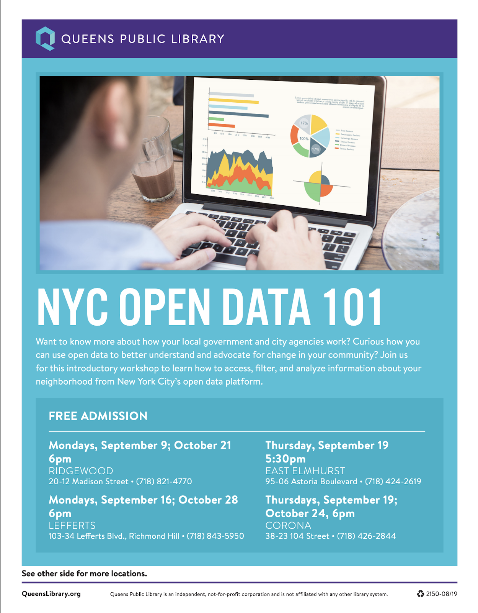

# Queens Public Library, Queens, NY

**Partner organizations:** [Mayor’s Office of Data Analytics](https://www1.nyc.gov/site/analytics/index.page)

**Library roles played:** [Developing civic data literacy](../library-roles/developing-civic-data-literacy.md); [Making civic data more usable](../library-roles/making-civic-data-more-usable.md); [Showing the importance of civic data](../library-roles/showing-importance-civic-data.md)


**The** [**Queens Public Library**](https://www.queenslibrary.org/) **\(QPL\) project,** _**Data Counts**_**,  trained library staff to provide open data workshops in hard-to-count census tracts, provided training and resources to partner organizations working with hard-to-count populations, and developed a community trainer program in collaboration with the NYC Mayor’s Office of Data Analytics that was designed to increase public engagement with the city's open data portal. QPL was able to maximize their reach by targeting multiple audiences with trainings, making the training curriculum public, and implementing community trainers to promote open data. The library continues to expand its community trainer program and Census outreach with multiple NYC public library partners.**


We designed Data Counts at Queens Public Library \(QPL\) as an intervention that could help mitigate the threat of an undercount in the upcoming 2020 Census. Based on 2010 mail response rates for Queens County, more than 67 percent of county residents live in ‘hard-to-count’ census tracts. Additionally, populations that the Census Bureau defines as hard to count \(children ages 0 to 5, people with low incomes, racial and ethnic minorities, renters, and undocumented and recent immigrants\) make up a large portion of not only county residents, but also QPL cardholders. We approached Data Counts with the belief that we could support a safe and accurate count in 2020 by increasing both awareness of open data resources and training participants on using these resources to better understand and advocate for their communities.  

Data Counts identified three key areas to address data literacy: staff development, partner engagement, and public facing workshops. While data literacy was a new strategic area for QPL—save for some previous one-off collaborations with the New York City \(NYC\) Mayor’s Office of Data Analytics \(MODA\)—our roles as project managers, training providers, and connectors were ones we have long served.

For the staff development and partner engagement components, we convened a consultant in December 2018 to design and lead a three-part, 7.5 hour training for QPL staff on locating, understanding, and utilizing open data resources. Staff development workshops occurred at our Central Library in February 2019, reaching 21 staff members from QPL locations serving hard-to-count census tracts. We decided to start with staff workshops so that library workers at these locations could bring these open data resources into reference interactions throughout the year leading up to Census 2020.

Our consultant also designed a three-hour training based off this curriculum \(see below\) to use with partner organizations that also serve hard-to-count populations \(NYC Housing Authority program providers, Queens Borough President’s Immigration Task Force member organizations, etc.\).

> ## Deeper partnerships with our project collaborators has been the most exciting success to come out of this initiative.

For our final component—public-facing data literacy workshops—we worked with our local civic data agency, the [Mayor’s Office of Data Analytics](https://www1.nyc.gov/site/analytics/index.page), to train a cohort of volunteer ‘Open Data Ambassadors.’ MODA sub-contracted with BetaNYC, a civic tech firm, to design and lead a training for 14 ambassadors in July 2019 at our Long Island City Community Library. These public workshops began in September 2019, with 28 sessions scheduled across 20 locations in September and October. These workshops will continue leading up to Census Day on April 1, 2020.

Deeper partnerships with our project collaborators has been the most exciting success to come out of this initiative. Serving as a training resource for other organizations working with hard-to- count populations has helped us make connections that will continue into 2020 as we prepare for Census Day. 

Many of our workshop participants attended a training we hosted with the [New School’s Digital Equity Lab](https://www.newschool.edu/digital-equity-lab/) on preparing community based organizations to conduct census outreach and engagement. Similarly, our partnership with MODA has been a major success. We had worked with MODA for the past two years to host library events during NYC Open Data Week, but this is our first time collaborating on an extended project. We are thrilled to be piloting an Open Data Ambassadors program that we hope can expand to our sister systems at Brooklyn Public Library and New York Public Library to make open data accessible to all New York City residents.

One major learning for us at QPL has been that open data literacy is civic literacy. The curriculum designed by our colleagues at BetaNYC grounds open data in place, asking participants to think about all the layers of city government representing them. From State Senator all the way down to Community Board, resources shared on open data platforms are tools to hold elected officials accountable and to provide recourse for community members by identifying inequities or inconsistencies in services. So many people are intimidated by the word ‘data,’ or by the technology we are teaching to understand and analyze that data, that they miss this key point. For libraries who feel like they do not have the technical capacity on staff, or that the interest is not there in their patrons, I would share this framing.  

### **Learn More:**

* Microsoft Excel Basics with Open Data : [Introduction](http://bit.ly/pdexcel1), [Formulas and Functions](http://bit.ly/pdexcel2), [Pivot Tables and Charts](http://bit.ly/pdexcel2) 
* [Data Counts Curriculum](https://nam05.safelinks.protection.outlook.com/?url=https%3A%2F%2Fdrive.google.com%2Fopen%3Fid%3D1WAUcXhZW0RhNywIUzD5YJN-ZU7qFWMwL&data=02%7C01%7Ccivic-switchboard%40pitt.edu%7C1c831f95065d473949e508d77d7fdba4%7C9ef9f489e0a04eeb87cc3a526112fd0d%7C1%7C0%7C637115860573914161&sdata=njn6e%2FhwR6rB7UFNOwndstxcjtIUhTzVy5bwIaG%2FL1c%3D&reserved=0) \(staff workshop and partner workshop\)
* [Open Data 101](https://nam05.safelinks.protection.outlook.com/?url=https%3A%2F%2Fdrive.google.com%2Fopen%3Fid%3D1YGhKuDS1ZY0JZ68-m_I2JaKlO6x8u3XB&data=02%7C01%7Ccivic-switchboard%40pitt.edu%7C1c831f95065d473949e508d77d7fdba4%7C9ef9f489e0a04eeb87cc3a526112fd0d%7C1%7C0%7C637115860573914161&sdata=4pX93kgczpQh6ipuZ3ffMp2blTu6Md%2F1arE1IcmsMAc%3D&reserved=0) \(patron-facing workshop\)

