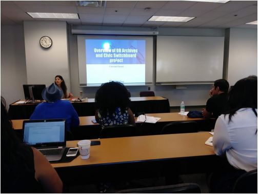

# Robert L. Bogomolny Library at the University of Baltimore, MD

**Partner organizations:** [Baltimore Neighborhood Indicators Alliance \(BNIA\) at the University of Baltimore \(UB\)](https://bniajfi.org/)

**Library roles played:** [Showing the importance of civic data,](../library-roles/showing-importance-civic-data.md) [Developing civic data literacy](../library-roles/developing-civic-data-literacy.md), [Making civic data more useable](../library-roles/making-civic-data-more-usable.md)


**Many libraries maintain archives that are rich with information about local history and civic life. Archival collections containing qualitative information, drawn from many points in time, can be a valuable compliment to local civic data, which are often contemporary and quantitative.** 

**The Baltimore project team members designed learning modules that connected the library's archival collections to the neighborhood indicators partner's community-based open data. Being mindful of sustainability, the project found ways to build their work onto existing programs, structures, and organizational goals. This case study also shows that when forming new partnerships, it is important to take dedicated time for each partner to learn about the other; this lays a foundation necessary for successful collaboration.** 


The Baltimore Regional Study Archives \(BRSA\) at the [Robert L. Bogomolny Library](https://langsdale.ubalt.edu/) contains a treasure of archival information on Baltimore’s neighborhoods. Additionally, the Baltimore Neighborhood Indicators Alliance \(BNIA\) also at the University of Baltimore \(UB\) hosts a great deal of community-based, open data about and for Baltimore. However, the Library and BNIA do not generally have internal resources to work together to provide assistance to potential users. The purpose of this collaboration was to create scaffolded learning experiences and pedagogical supports to better understand how to access both archival materials as well as open data to empower everyone who cares about neighborhoods to effectively “tell their story”. Before our initiative to connect these two resources, there was not a clear pathway that allowed potential users to make this link. We hoped that making step-by-step guidelines would produce positive contributions to UB faculty and students ****as well as Baltimore communities and the wider public audience.

The collaboration was organized around a three-week classroom activity in the spring Introduction to Information Literacy course at the University of Baltimore. The course focused on helping UB students learn to work with community information stored in Library archives and contemporary information systems developed by BNIA. Secondary goals included building awareness of these resources both among faculty and other members of Baltimore’s community. 

We focused on creating a specific learning module that provided step-by-step instructions on how to access one representative collection from the Archives' Model Urban Neighborhood Demonstration \(MUND\) Collection and explore the community data in Vital Signs. Joining archival sources with contemporary community-based open  data prompts students to examine how a community changed over time and if initiatives or trends that began in the 1960’s are present in the early 21 century as reflected through BNIA’s Vital Signs indicators. The connection to qualitative data about neighborhoods was particularly welcomed by community organizations. 

> ## We had to learn how to speak each other’s language and learn how to communicate in ways that made sense across disciplines.

Since this project was the first official collaboration between the Library and BNIA, we had to familiarize ourselves with the resources available and services provided by one another.  We had to learn how to speak each other’s language and learn how to communicate in ways that made sense across disciplines. Another challenge we faced involved finding relevant connections between the archival collections and available civic data. Finally, the students in the class were participating remotely, and the online environment required more engagement and guidance by the instructor and  limited potential community interactions. 

While the funding for this project was significant, it was not enough to alter the course of existing work loads for staff either at the Library or at BNIA, nor should it have been. To become a truly sustainable resource, we had to create linkages that enhance ongoing activities and events. These included classroom instruction and links to student learning outcomes \(Library\), community engagement \(BNIA\), online resources \(Library and BNIA\) and our annual workshop Baltimore Data Day \(UB\). 

This project allowed us to demonstrate the role the collaboration could play in publicizing our collective resources to Baltimore communities, UB faculty, and UB students. We learned how our resources can provide complementary content for community initiatives, and BNIA hopes one day to integrate a librarian or student of library science with their team to support data management activities.  Other academic libraries and community civic data initiatives should consider partnerships to promote the availability of archival and civic data on campus and in communities surrounding the institution.  

### Learn More:

* [Learning Modules and Lesson Plans](https://bniajfi.org/resources/learning-community/for-instructors/faculty-resources/archives-and-indicators/)

